# Phase 3 quantitative research platform

## Status

This repository now contains a professional research-platform architecture for determining whether an OKX perpetual-futures strategy has genuine positive expectancy.

It does **not** establish that any strategy is profitable. No corrected immutable derivatives dataset, complete walk-forward run, higher-cost stress run, or untouched holdout result is committed. Live execution remains disabled throughout the platform.

## Architecture

```mermaid
flowchart LR
  subgraph Exchange[OKX public market data]
    Trades[Trades]
    Books[Order-book depth]
    Candles[Candles]
    OI[Open interest]
    Funding[Funding]
    Liq[Liquidations]
    Mark[Mark and index]
    Meta[Contract metadata]
  end

  subgraph Collection[Collection and integrity]
    Rest[OKXHistoricalDataClient]
    Live[Existing WebSocket collectors]
    Pipeline[HistoricalDataPipeline]
    Integrity[MarketDataIntegrity]
    Sync[DerivativeEventSynchronizer]
  end

  subgraph Storage[PostgreSQL research store]
    Market[(Partitioned market tables)]
    FeatureDb[(Feature and signal tables)]
    ExperimentDb[(Backtest, walk-forward and optimization tables)]
    ExecutionDb[(Orders, fills and risk events)]
  end

  subgraph Research[Research computation]
    Features[FeaturePipeline]
    Importance[Permutation importance and ablation]
    Strategies[StrategyLaboratory]
    Optimizer[Purged walk-forward optimizer]
    Validation[StrategyValidation]
    Comparison[StrategyComparison]
  end

  subgraph RiskExecution[Risk and execution]
    PositionRisk[ProfessionalRiskManager]
    Portfolio[PortfolioEngine]
    Fill[ExecutionSimulator]
    Paper[PaperTradingEngine]
  end

  subgraph Reporting[Reporting]
    Stats[BacktestStatistics]
    Analytics[ResearchAnalytics]
    CLI[CLI summary]
    Web[Optional web dashboard]
  end

  Exchange --> Rest
  Exchange --> Live
  Rest --> Pipeline
  Live --> Pipeline
  Pipeline --> Integrity
  Integrity --> Market
  Market --> Sync
  Sync --> Features
  Features --> FeatureDb
  Features --> Importance
  FeatureDb --> Strategies
  Strategies --> Optimizer
  Optimizer --> ExperimentDb
  Optimizer --> Validation
  Validation --> Comparison
  Strategies --> PositionRisk
  PositionRisk --> Portfolio
  Portfolio --> Fill
  Fill --> Paper
  Paper --> ExecutionDb
  ExperimentDb --> Stats
  ExecutionDb --> Stats
  Stats --> Analytics
  Analytics --> CLI
  Analytics --> Web
```

## Historical data collection

### Canonical records

`src/data/ResearchMarketData.ts` defines immutable millisecond-resolution records for:

- public trades;
- order-book snapshots and depth levels;
- confirmed candles and volume;
- open interest;
- funding rates;
- liquidation events;
- independent mark and index prices;
- best bid and ask;
- contract metadata.

Every record contains `observedAt`, `receivedAt`, instrument identity, and source provenance.

### OKX client

`OKXHistoricalDataClient` implements normalized public REST access for:

- paginated trade history;
- historical candles;
- funding-rate history;
- current open-interest snapshots;
- current order-book snapshots;
- independent synchronized mark and index snapshots;
- contract metadata.

The client does not invent unavailable history. Sequence-aware depth, event-time liquidation flow, and tick-equivalent mark/index history must be captured live or imported from a verified archive.

### Gap detection and recovery

`HistoricalDataPipeline` provides:

- bounded pagination;
- repeated-cursor protection;
- configurable cadence checks for regular streams;
- automatic gap-recovery passes;
- conflict detection for duplicate identities;
- integrity validation before persistence;
- atomic database writes;
- a dataset manifest describing pages, recovery, remaining gaps, and rejection reasons.

Irregular trade streams are not assigned a fabricated fixed interval.

### Dataset rejection

`MarketDataIntegrity` rejects:

- invalid ranges or timestamps;
- records received before their exchange timestamp;
- instrument mismatches;
- conflicting duplicates;
- non-finite or invalid prices and sizes;
- crossed or unsorted books;
- malformed or unconfirmed candles;
- records outside the declared collection range;
- unresolved cadence gaps for streams that require regular sampling.

## PostgreSQL database

Migrations are stored in `db/migrations` and are executed against a real PostgreSQL service in GitHub Actions.

### Normalized domains

The schema contains:

- instruments and versioned metadata;
- trades;
- order-book snapshots and normalized depth levels;
- candles and volumes;
- open interest;
- funding;
- liquidations;
- mark/index prices and quotes;
- feature definitions and values;
- strategy definitions and signals;
- orders, fills, and risk events;
- backtests;
- walk-forward runs and folds;
- hyperparameter experiments and trials.

### Partitioning and indexes

Large event tables are range-partitioned by millisecond timestamp. Default partitions prevent rejected inserts when monthly partitions have not yet been provisioned. The second migration includes a monthly partition-maintenance procedure.

Indexes prioritize instrument/time replay, feature lookup, strategy/run lookup, and order/risk inspection.

Before attaching a new monthly partition in production, overlapping rows must be moved out of the default partition. This operational procedure is intentionally not hidden inside application code.

### Application contract

`ResearchStore` defines the persistence boundary. `PostgresResearchStore` uses parameterized SQL, explicit transactions, immutable input records, and a driver-neutral pool contract. A production bootstrap may inject a `node-postgres` pool without coupling research modules to the driver.

Current inserts prioritize correctness and auditability. High-volume production ingestion should add batched `COPY` staging after benchmark evidence identifies row-by-row insertion as a bottleneck.

## Feature engineering

`FeaturePipeline` calculates pure, timestamp-bounded features:

- aggressive delta;
- normalized delta;
- cumulative volume delta;
- order-book imbalance;
- distance-weighted liquidity imbalance;
- funding level and acceleration;
- open-interest momentum;
- mark/index basis;
- ATR percentage;
- annualized realized volatility;
- VWAP deviation in ATR units;
- trend efficiency;
- trend/range and volatility regime.

Feature vectors include `sourceMaxObservedAt`, allowing the platform to prove that no source timestamp exceeded the decision timestamp.

`FeatureImportance` provides deterministic seeded permutation importance. `FeatureAblation` provides paired episode-level bootstrap evidence. A feature should enter a strategy only after both incremental statistical evidence and complete out-of-sample validation.

## Strategy laboratory

All research strategies implement the `ResearchStrategy` interface and return the same `LaboratoryDecision` contract.

Current comparable candidates are:

- `original-whale-baseline` — an explicit whale-only baseline;
- `derivatives-flow-v1` — flow-confirmed structure strategy;
- `trend-following-v1` — a deliberately simple trend candidate;
- `mean-reversion-v1` — a range/VWAP-dislocation candidate.

These candidates are comparison subjects, not approved systems. All decisions set `liveExecutionAllowed: false`.

## Hyperparameter optimization

`WalkForwardOptimizer` performs bounded deterministic grid search across existing purged walk-forward folds.

It:

- never accesses the final holdout during optimization;
- stores every successful, rejected, and failed trial;
- rejects insufficient out-of-sample trades;
- rejects unstable positive-fold coverage;
- rejects undefined objectives;
- penalizes drawdown and train/test performance collapse;
- exposes a separate one-shot function for frozen holdout evaluation.

The interface can support a future Bayesian or Optuna-compatible coordinator, but an external optimizer must obey the same fold and holdout boundary. Adding Python or a machine-learning stack is not justified until deterministic baselines and data quality are established.

## Portfolio engine

`PortfolioEngine` supports multiple perpetual contracts and enforces:

- edge-to-volatility capital allocation;
- gross exposure limits;
- net directional exposure limits;
- maximum leverage;
- sector exposure limits;
- correlation-group exposure limits;
- historical portfolio Value-at-Risk;
- portfolio drawdown circuit breaking.

Individual strategies cannot bypass portfolio authority.

## Analytics

`ResearchAnalytics` derives one immutable report for both CLI and web presentation:

- equity curve;
- drawdown;
- win rate;
- profit factor;
- expectancy;
- Sharpe and Sortino ratios;
- recovery factor;
- fees and funding;
- daily and monthly returns;
- rolling Sharpe;
- rolling drawdown;
- exposure history;
- R-multiple distribution.

The optional web dashboard uses the built-in Node HTTP server and has no additional production dependency. It serves HTML at `/` and the exact report JSON at `/api/report`.

## Paper trading

`PaperTradingEngine` mirrors important exchange mechanics:

- tick-size price normalization;
- lot-size and minimum-size normalization;
- contract-value conversion;
- exchange maximum leverage;
- stale-book rejection;
- marketable-limit checks;
- depth participation and partial fills;
- spread, slippage, fees, latency, and retry delay;
- transient API failure and retry exhaustion;
- funding payments or receipts;
- partial position closes;
- daily order, PnL, fee, funding, and open-position reports.

It reuses the same depth-aware fill simulator as backtesting. Non-marketable resting-limit queue simulation is rejected rather than approximated without queue data.

## Strategy comparison

`StrategyComparison` ranks strategies using risk-adjusted and regime-aware metrics, but promotion is gated separately.

Each candidate is evaluated for:

- profit factor;
- expectancy;
- Sharpe;
- Sortino;
- maximum drawdown;
- recovery factor;
- positive-regime coverage;
- a composite robust score.

A challenger is eligible only for paper comparison when:

- it has already passed the full validation gate;
- it is stable across the required fraction of regimes;
- it has enough episodes paired with the baseline;
- the paired bootstrap confidence interval for incremental PnL excludes zero.

Ranking alone never promotes a strategy.

## Files added in Phase 3

### Data

- `src/data/ResearchMarketData.ts`
- `src/data/MarketDataIntegrity.ts`
- `src/data/HistoricalDataPipeline.ts`
- `src/clients/okx/OKXHistoricalDataClient.ts`

### Database

- `db/migrations/001_research_platform.sql`
- `db/migrations/002_market_volumes_and_partition_maintenance.sql`
- `src/storage/ResearchStore.ts`
- `src/storage/PostgresResearchStore.ts`

### Features and strategies

- `src/features/FeaturePipeline.ts`
- `src/features/FeatureImportance.ts`
- `src/strategy/StrategyLaboratory.ts`
- `src/research/WalkForwardOptimizer.ts`
- `src/research/StrategyComparison.ts`

### Portfolio, paper, and analytics

- `src/portfolio/PortfolioEngine.ts`
- `src/paper/PaperTradingEngine.ts`
- `src/analytics/ResearchAnalytics.ts`

### Tests

- `test/MarketDataIntegrity.test.ts`
- `test/HistoricalDataPipeline.test.ts`
- `test/OKXHistoricalDataClient.test.ts`
- `test/PostgresResearchStore.test.ts`
- `test/FeaturePipeline.test.ts`
- `test/FeatureImportance.test.ts`
- `test/StrategyLaboratory.test.ts`
- `test/WalkForwardOptimizer.test.ts`
- `test/PortfolioEngine.test.ts`
- `test/ResearchAnalytics.test.ts`
- `test/PaperTradingEngine.test.ts`
- `test/StrategyComparison.test.ts`

## Files removed

None.

The existing evidence, replay, chronology, path-ordering, statistical, safety, and legacy audit modules remain useful. Removing them without a complete dependency and historical-record migration would reduce reproducibility. Deletion should follow measured import/coverage analysis, not an arbitrary cleanup target.

## Verification

The root GitHub Actions workflow now verifies:

1. PostgreSQL starts successfully.
2. Both research migrations execute with `ON_ERROR_STOP`.
3. Migration records are present.
4. `npm ci` succeeds.
5. Type checking succeeds.
6. ESLint succeeds.
7. The complete Vitest suite succeeds.
8. The production TypeScript build succeeds.

## Remaining limitations

1. A corrected immutable derivatives dataset is still absent.
2. Continuous sequence-aware depth, liquidation, OI, and mark/index capture is not yet deployed as a long-running production service.
3. REST and WebSocket rate-limit coordination needs a shared adaptive scheduler.
4. Database ingestion is transactional but not yet optimized with `COPY` staging.
5. Default-partition maintenance requires an operational runbook before very large production ingestion.
6. Queue position, maker fills, cancellation during latency, and hidden liquidity are not modeled.
7. Exact OKX maintenance-margin tiers, account modes, liquidation fees, ADL, and insurance-fund behavior are not modeled.
8. Historical return scenarios for portfolio VaR must be generated from the corrected synchronized dataset.
9. No candidate has completed real purged walk-forward, higher-cost stress, untouched holdout, and prolonged paper execution.
10. The older evidence schemas still require a full expiry-`FUTURES` compatibility migration if expiry futures are included in the same platform deployment.

## Required next evidence cycle

1. Deploy event-time perpetual-futures collection with PostgreSQL persistence.
2. Collect multiple instruments across trend, range, high-volatility, and low-volatility regimes.
3. Verify gaps, chronology, checksums, sequence continuity, and contract metadata.
4. Reproduce the original whale baseline on the corrected population.
5. Run the original whale baseline, derivatives flow V1, simple trend, and simple mean-reversion candidates on identical episodes.
6. Perform one-feature-at-a-time ablation.
7. Run purged walk-forward optimization on discovery data only.
8. Stress fees, latency, spread, participation, funding, and slippage.
9. Freeze code and parameters.
10. Evaluate the untouched holdout once.
11. Require prolonged paper execution and reconciliation.
12. Conduct an exchange-exact operational review before any testnet proposal.

## Merge policy

This branch must remain a Draft PR until real validation evidence exists. Platform tests and database integration establish engineering consistency, not positive expectancy.

Do not merge to `main`, tag a stable trading release, or enable order submission based only on this implementation.
