# Phase 4 trading edge and release assessment

## Executive decision

**Release status: BLOCKED**

No strategy in the repository currently demonstrates statistically supported positive expectancy under the required realistic assumptions.

This is not a conclusion that every strategy is permanently unprofitable. It is a conclusion that the repository does not yet contain the independent real-market evidence required to establish profitability.

The pull request must remain Draft. It must not be merged, marked ready for review, tagged as a release candidate, or used to authorize live order submission.

## Why no strategy can be promoted

The repository still lacks a corrected immutable derivatives dataset that simultaneously provides:

- sequence-complete event-time depth;
- executed trades and aggressor direction;
- open interest;
- funding;
- liquidation flow;
- independent mark and index prices;
- best bid and ask;
- contract metadata;
- sufficient duration and instrument coverage;
- bull, bear, sideways, high-volatility, and low-volatility regimes;
- a discovery partition isolated from a final untouched holdout;
- an extended live-market paper-trading record.

Engineering tests and synthetic fixtures are useful for proving deterministic behavior. They are not market-performance evidence and are explicitly rejected by the Phase 4 robustness and release gates.

## Current candidate assessment

| Strategy | Feature evidence | Walk-forward and holdout | Adverse-cost matrix | Extended paper evaluation | Current status |
| --- | --- | --- | --- | --- | --- |
| Original Whale Strategy | Not established on corrected derivatives data | Not completed | Not completed | Not completed | Excluded |
| Derivatives Flow V1 | Candidate logic exists; incremental feature value is not established on real data | Not completed | Not completed | Not completed | Excluded |
| Trend Following V1 | Candidate logic exists; no real-data edge evidence | Not completed | Not completed | Not completed | Excluded |
| Mean Reversion V1 | Candidate logic exists; no real-data edge evidence | Not completed | Not completed | Not completed | Excluded |

No numeric leaderboard is published because doing so would mix unvalidated, synthetic, incomplete, or non-independent results with release-quality evidence.

## Phase 4 architecture

```mermaid
flowchart LR
  Data[Immutable real-market dataset] --> Integrity[Integrity and leakage gates]
  Integrity --> Features[Fold importance and paired ablation]
  Features --> Selection[Redundancy and complexity selection]
  Selection --> WalkForward[Purged walk-forward discovery]
  WalkForward --> Stress[Regime and adverse-cost matrix]
  Stress --> Freeze[Freeze code and parameters]
  Freeze --> Holdout[One-time untouched holdout]
  Holdout --> Paper[Extended live-market paper execution]
  Paper --> Compare[Paired baseline comparison]
  Compare --> ReleaseGate[ReleaseCandidateGate]
  ReleaseGate -->|all gates pass| RC[Release candidate]
  ReleaseGate -->|any gate fails| Blocked[Draft and blocked]
```

## Feature-selection policy

`FeatureSelection` separates directional research features from operational safeguards.

### Directional and regime features

An alpha or regime feature is retained only when all of the following are true:

1. It has importance observations across the minimum number of independent folds.
2. Its importance is positive across the required fraction of folds.
3. Its median importance is positive.
4. Its importance is not excessively unstable.
5. A paired episode-level ablation test supports incremental value.
6. It is not redundant with a stronger retained feature.
7. It fits within the frozen feature-complexity budget.

A feature is removed when it is unstable, redundant, unsupported by ablation, or outside the complexity budget.

### Risk and execution filters

Spread, slippage, depth, participation, freshness, and related filters may be retained without claiming that they predict direction. Their purpose is to prevent unrealistic fills, stale decisions, or unsafe sizing.

They must be labelled as `RISK_FILTER` or `EXECUTION_FILTER` and have a documented operational purpose. They are not counted as evidence of alpha.

## Confluence decisions

No new confluence was promoted into a frozen strategy during Phase 4 because no corrected dataset exists to prove incremental out-of-sample value.

The following remain research candidates only:

### Market structure

- break of structure;
- change of character;
- higher-high and higher-low sequences;
- lower-high and lower-low sequences.

These require deterministic swing definitions fixed before evaluation. Changing pivot widths after seeing results would create selection bias.

### Liquidity

- liquidity sweeps;
- equal highs and lows;
- stop-hunt patterns;
- liquidity voids.

These require point-in-time definitions and depth-aware execution. A price wick alone is not sufficient proof of a stop hunt.

### Order flow

- CVD;
- delta divergence;
- aggressive imbalance;
- absorption;
- exhaustion.

Iceberg detection is not considered reliable without order-level identifiers or a validated refill inference model. Repeated visible size alone may represent cancellation, replacement, aggregation, or multiple participants.

### Derivatives

- open-interest expansion and contraction;
- funding extremes and acceleration;
- basis expansion and contraction;
- liquidation clusters and cascades.

Long/short ratios are not accepted unless their source, population, update timing, and historical availability are proven reliable.

### Volume and price location

- relative volume;
- anchored VWAP;
- session VWAP;
- volume profile;
- high-volume and low-volume nodes.

Volume-profile features require stable session definitions and must survive paired ablation. They are not retained merely because they look visually meaningful.

### Volatility and trend

- ATR and realized volatility;
- volatility compression and expansion;
- EMA alignment;
- trend efficiency;
- ADX;
- multi-timeframe confirmation.

ADX and multi-timeframe confirmation are not promoted without evidence that they add value beyond trend efficiency and volatility regime features.

### Event filters

A news blackout is not implemented as a release feature because no verified, timestamped event feed is part of the immutable dataset. A hand-maintained calendar would be incomplete and create hindsight risk.

## Robustness validation

`RobustnessValidation` requires a complete matrix across:

- bull trend;
- bear trend;
- sideways market;
- high volatility;
- low volatility.

For every required regime, the same immutable real-market dataset fingerprint must be replayed under:

- baseline costs;
- fees increased by at least 50%;
- slippage increased by at least 100%;
- funding increased by at least 100%;
- a combined adverse scenario with higher fees, slippage, funding, and reduced available depth.

The validator rejects:

- missing regime or stress cells;
- synthetic or mixed-source evidence;
- mismatched dataset fingerprints;
- insufficient trades or independent episodes;
- non-positive stress expectancy;
- inadequate profit factor;
- excessive drawdown;
- severe expectancy collapse;
- stress scenarios whose assumptions are too weak for their labels.

## Validated leaderboard

`ValidatedLeaderboard` ranks only strategies whose independent feature-selection, strategy-validation, and robustness gates have passed.

Unvalidated strategies remain visible as excluded rows, but their expectancy, profit factor, Sharpe, Sortino, drawdown, recovery factor, and robust score are withheld from the validated ranking.

This prevents a visually attractive but unvalidated backtest from outranking a strategy with genuine independent evidence.

At the current repository state, all four strategies are excluded and the validated leaderboard is empty.

## Release-candidate criteria

`ReleaseCandidateGate` requires all of the following.

### Dataset

- real-market source only;
- immutable and manifest-verified;
- at least 180 days;
- at least three instruments;
- no unresolved gaps;
- passed integrity and leakage checks;
- complete required data streams;
- all required regimes represented.

### Feature selection

- selection status passed;
- at least one evidence-supported research feature;
- no more than eight retained research features by default.

### Discovery validation

- purged walk-forward and untouched-holdout validation status passed;
- robustness matrix passed on the exact discovery dataset fingerprint.

### Frozen holdout

- real-market source;
- fingerprint isolated from discovery;
- exact frozen code commit and configuration hash;
- parameter freeze before evaluation;
- evaluated exactly once;
- at least 100 trades;
- positive expectancy;
- profit factor of at least 1.10;
- average R greater than 0.02;
- Sharpe and Sortino of at least 0.50;
- maximum drawdown no greater than 20%.

### Extended paper trading

- live-market source rather than synthetic or historical-only simulation;
- exact frozen code commit and configuration hash;
- at least 30 days;
- at least 100 order intents and 100 completed trades;
- no unresolved data gaps or duplicate fills;
- reconciliation error rate no greater than 0.1%;
- positive expectancy;
- profit factor of at least 1.05;
- positive average R;
- non-negative Sharpe;
- maximum drawdown no greater than 15%.

### Baseline comparison

- at least 100 paired independent episodes against the original whale baseline;
- positive lower bound of the paired confidence interval;
- at least 95% bootstrap probability of improvement.

### Engineering and operational checks

- unit tests passed;
- integration tests passed;
- lint passed;
- type checking passed;
- production build passed;
- PostgreSQL migrations passed;
- GitHub Actions passed;
- live order submission remains disabled for the release candidate.

A release candidate remains a research software release. It does not automatically authorize real-money trading.

## Database changes

Migration `003_phase4_validation_and_release.sql` adds normalized audit tables for:

- feature-selection runs and per-feature decisions;
- robustness-validation runs and every scenario cell;
- paper-trading release evaluations;
- final release-candidate evaluations and blocking reasons.

GitHub Actions now executes every migration in lexical order rather than maintaining a hard-coded migration list.

## Files added in Phase 4

- `src/research/FeatureSelection.ts`
- `src/research/RobustnessValidation.ts`
- `src/research/ValidatedLeaderboard.ts`
- `src/release/ReleaseCandidateGate.ts`
- `db/migrations/003_phase4_validation_and_release.sql`
- `test/FeatureSelection.test.ts`
- `test/RobustnessValidation.test.ts`
- `test/ValidatedLeaderboard.test.ts`
- `test/ReleaseCandidateGate.test.ts`
- `docs/phase4-trading-edge-release-assessment.md`

## Files removed

None.

Existing historical, replay, evidence, safety, and strategy modules are still needed for migration, baseline reproduction, and auditability. Removing them before real-data comparison would reduce reproducibility.

## Remaining work before release

1. Deploy continuous PostgreSQL collection for all required derivatives streams.
2. Accumulate sufficient real-market duration, instruments, and regimes.
3. Freeze deterministic definitions for every candidate confluence.
4. Reproduce the original whale baseline on the corrected dataset.
5. Run fold-level importance and paired ablation for every candidate feature.
6. Remove unsupported and redundant features.
7. Run purged walk-forward discovery without accessing the holdout.
8. Run the complete regime and adverse-cost matrix.
9. Freeze the selected strategy code, configuration, and dataset manifests.
10. Evaluate the untouched holdout exactly once.
11. Run at least 30 days of reconciled live-market paper trading.
12. Compare the frozen candidate with the original baseline on paired episodes.
13. Run `ReleaseCandidateGate` using persisted evidence.
14. Mark the PR ready, merge, and tag only if the gate returns `RELEASE_CANDIDATE`.

## Git decision

The current evidence cannot satisfy the release gate.

Therefore:

- PR #1 remains Draft;
- the PR is not merged;
- no release tag is created;
- no release notes claiming performance are generated;
- live order submission remains disabled.
