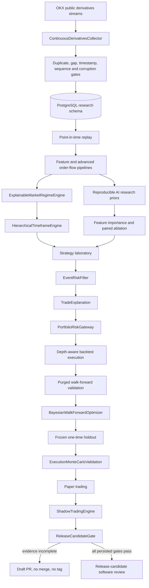

# Phase 5 complete quantitative research platform

## Executive result

The eleven engineering phases are implemented sequentially on the existing Draft pull request.

**Empirical release status remains BLOCKED.**

The repository now contains the software required to collect, classify, research, allocate, explain, stress, optimize, paper-test, and shadow-test perpetual-futures strategies. It still does not contain enough corrected independent real-market evidence to claim positive expectancy or permit a merge into `main`.

No profitability, Sharpe, Sortino, profit-factor, drawdown, win-rate, or expectancy improvement is claimed by this phase.

## End-to-end architecture

Live order submission remains outside this graph and remains disabled.

## Phase 1 — Historical data lake and continuous collection

### Existing foundation retained

The repository already provided:

- immutable millisecond-resolution market records;
- exchange and local receive timestamps;
- sequence-aware order-book records;
- historical pagination;
- duplicate conflict detection;
- timestamp gap detection and bounded recovery;
- corruption and chronology validation;
- dataset manifests;
- normalized PostgreSQL persistence for trades, depth, candles, open interest, funding, liquidations, mark/index, quotes, volume, and contract metadata.

### Added

`ContinuousDerivativesCollector` adds supervised continuous cycles with:

- durable cursor, timestamp, and sequence checkpoints;
- source watermarks;
- timestamp and receive-lag validation;
- future-data rejection;
- conflicting duplicate rejection;
- optional gap recovery before persistence;
- unresolved-gap rejection;
- dataset fingerprints;
- atomic checkpoint advancement after successful persistence;
- rejected-manifest persistence without advancing checkpoints.

The collector intentionally exposes `runCycle` rather than hiding an endless loop. A process supervisor, scheduler, or service runtime can control retries, shutdown, and cadence without losing deterministic behavior.

## Phase 2 — Explainable market regime detection

`ExplainableMarketRegimeEngine` classifies:

- trending bull;
- trending bear;
- sideways;
- high volatility;
- low volatility;
- funding squeeze;
- liquidation cascade;
- compression;
- expansion.

Every decision records:

- raw evidence values;
- threshold-based explanations;
- directional regime;
- independent overlays;
- confidence;
- strategy families activated;
- strategy families blocked.

A liquidation cascade can activate derivatives-flow research while blocking mean reversion. Compression can activate breakout research. Higher-level strategy activation is therefore explicit and testable.

## Phase 3 — Reproducible AI-assisted research

`ReproducibleAiResearch` limits model use to research roles:

- feature ranking;
- regime classification research;
- parameter priors;
- trade-quality scoring research;
- pattern clustering.

Safeguards include:

- deterministic seeds;
- model and version identity;
- dataset, code, and configuration fingerprints;
- independent fold scores;
- rank-stability analysis;
- positive-fold coverage;
- paired ablation requirements;
- reproducible artifact fingerprints;
- structural rejection of direct AI trading signals.

A stable model-ranked feature remains `AI_PRIOR_ONLY` until paired episode-level ablation demonstrates incremental value. AI output cannot authorize a trade.

## Phase 4 — Portfolio optimization and unified risk gateway

`PortfolioRiskGateway` introduces:

- configurable risk parity;
- configurable fractional Kelly;
- hybrid Kelly/risk-parity scoring;
- maximum simultaneous positions;
- pair-correlation admission limits;
- drawdown-dependent dynamic leverage;
- hard portfolio drawdown breaker.

Admitted proposals are still passed into the existing portfolio engine, which enforces:

- gross and net exposure;
- maximum leverage;
- sector exposure;
- correlation-group exposure;
- historical portfolio VaR;
- portfolio drawdown limits.

Strategies submit proposals. They do not allocate capital directly and cannot bypass portfolio controls.

## Phase 5 — Advanced order flow

`AdvancedOrderFlowFeatures` calculates:

- multi-level order-book imbalance;
- queue imbalance when order counts are available;
- near-touch weighted liquidity imbalance;
- aggressive buy and sell volume;
- delta and normalized delta;
- cumulative volume delta;
- delta divergence;
- open-interest expansion and contraction;
- funding acceleration;
- absorption;
- exhaustion.

Spoofing and hidden-liquidity observations are explicitly labelled `INFERRED_WITH_LIMITATIONS` because public aggregated depth lacks stable order identifiers. The reports include limitations explaining cancellation/replacement ambiguity and multi-participant replenishment. These fields are research-only and do not produce direct trading signals.

## Phase 6 — Multi-timeframe framework

`HierarchicalTimeframeEngine` provides a configurable hierarchy. The default roles are:

| Timeframe | Default responsibility |
| --- | --- |
| 1D | Macro trend |
| 4H | Directional bias |
| 1H | Context |
| 15M | Setup |
| 5M | Entry |
| 1M | Precision |

The engine checks:

- required timeframe availability;
- candle/state confirmation;
- timeframe-specific freshness;
- weighted higher-timeframe bias;
- setup alignment;
- entry confidence;
- optional precision alignment.

Lower-timeframe entries are blocked when the higher-timeframe bias is neutral or conflicting.

## Phase 7 — Event risk filter

`EventRiskFilter` supports configurable windows for:

- CPI;
- FOMC;
- NFP;
- exchange maintenance;
- token unlocks;
- ETF announcements;
- other high-impact scheduled events.

Point-in-time protections include:

- events published after the decision are ignored;
- unverified sources are ignored by default;
- events can be global, instrument-specific, or sector-specific;
- categories and individual event windows can be customized;
- the entire feature can be disabled.

A production event feed is still an external dependency. The repository does not fabricate event history.

## Phase 8 — Trade explainability

`TradeExplanation` produces one deterministic machine-readable record and one human-readable report containing:

- entry and exit scores;
- weighted score components;
- active confirmations;
- passed, warning, and blocked filters;
- rejected conditions;
- regime and regime evidence;
- account and portfolio risk calculations;
- position sizing method;
- stop type, price, and rationale;
- take-profit type, prices, and rationale;
- exit reason;
- code, configuration, and dataset provenance;
- calculation fingerprint.

Approved, blocked, open, and exited decisions remain auditable. Blocked signals are not silently discarded.

## Phase 9 — Execution-aware Monte Carlo validation

`ExecutionMonteCarloValidation` preserves independent episode groups while randomizing and stressing:

- episode sequence;
- fees;
- funding;
- slippage;
- latency;
- missed fills;
- partial fills.

It generates distributions for:

- ending equity;
- net return;
- maximum drawdown;
- expected-return confidence interval;
- probability of ruin;
- probability of positive return;
- average missed fills;
- average partial fills.

This complements the earlier alpha episode-resampling implementation. A single chronological backtest cannot pass validation by itself.

## Phase 10 — Bayesian-style optimization

`BayesianWalkForwardOptimizer` implements a deterministic sequential distance-surrogate optimizer over a frozen discrete parameter space.

It provides:

- seeded initial exploration;
- surrogate mean estimates;
- distance-based uncertainty;
- exploration-aware acquisition;
- purged discovery scope only;
- dataset fingerprint consistency;
- fold trade-count requirements;
- positive-fold coverage;
- fold objective stability;
- fold drawdown limits;
- neighboring-parameter stability.

The evaluator receives only `PURGED_DISCOVERY`. Any report of holdout access is rejected. The final untouched holdout remains a separate one-time evaluation after parameters and code are frozen.

## Phase 11 — Shadow trading

`ShadowTradingEngine` receives live signals and live order books but never submits an order.

It:

- reuses the depth-aware execution simulator;
- rejects stale or future books;
- records fills, partial fills, and rejected fills;
- compares shadow prices with paper execution references;
- records forward mark-price outcomes;
- measures direction-adjusted returns;
- records favorable outcomes after rejected fills as missed opportunities;
- generates daily fill, slippage, outcome, and reconciliation summaries;
- always records `liveOrderSubmitted: false`.

## Database migration 004

`004_phase5_sequential_platform.sql` adds audit and evidence tables for:

- continuous collection checkpoints and manifests;
- regime decisions;
- AI research runs and feature decisions;
- portfolio gateway decisions;
- advanced order-flow vectors;
- timeframe hierarchy decisions;
- scheduled risk events and event-risk decisions;
- trade explanations;
- execution Monte Carlo runs;
- Bayesian optimization runs and trials;
- shadow trade records, outcomes, and daily reports.

The root CI workflow applies migrations in lexical order with `ON_ERROR_STOP`.

## Files added

### Source

- `src/data/ContinuousDerivativesCollector.ts`
- `src/regime/ExplainableMarketRegimeEngine.ts`
- `src/research/ReproducibleAiResearch.ts`
- `src/portfolio/PortfolioRiskGateway.ts`
- `src/orderflow/AdvancedOrderFlowFeatures.ts`
- `src/timeframe/HierarchicalTimeframeEngine.ts`
- `src/risk/EventRiskFilter.ts`
- `src/explainability/TradeExplanation.ts`
- `src/research/ExecutionMonteCarloValidation.ts`
- `src/research/BayesianWalkForwardOptimizer.ts`
- `src/shadow/ShadowTradingEngine.ts`

### Database

- `db/migrations/004_phase5_sequential_platform.sql`

### Tests

- `test/ContinuousDerivativesCollector.test.ts`
- `test/ExplainableMarketRegimeEngine.test.ts`
- `test/ReproducibleAiResearch.test.ts`
- `test/PortfolioRiskGateway.test.ts`
- `test/AdvancedOrderFlowFeatures.test.ts`
- `test/HierarchicalTimeframeEngine.test.ts`
- `test/EventRiskFilter.test.ts`
- `test/TradeExplanation.test.ts`
- `test/ExecutionMonteCarloValidation.test.ts`
- `test/BayesianWalkForwardOptimizer.test.ts`
- `test/ShadowTradingEngine.test.ts`

## Files removed

None.

Legacy research and detector modules remain necessary for baseline reproduction, migration, replay compatibility, and auditability. Removing them before real-data comparison would weaken reproducibility.

## Strategy changes

No directional strategy was promoted or rewritten based on fabricated evidence.

The original whale strategy, Derivatives Flow V1, Trend Following V1, and Mean Reversion V1 remain research candidates. The new regime, order-flow, timeframe, event, AI, optimization, Monte Carlo, portfolio, and shadow components provide controlled ways to evaluate them.

No new confluence is retained in a frozen release candidate until it passes real-data feature importance, paired ablation, purged walk-forward validation, adverse-cost robustness, frozen holdout evaluation, and extended paper/shadow evaluation.

## Engineering improvements versus trading performance

Engineering improvements implemented in this phase include:

- checkpoint-safe continuous collection;
- more explicit regime and strategy activation;
- deterministic model governance;
- unified portfolio allocation and risk enforcement;
- support-aware order-flow inference;
- freshness-aware timeframe context;
- lookahead-safe event filtering;
- complete trade audit records;
- execution-aware distributional validation;
- stable-neighborhood optimization;
- shadow-versus-paper reconciliation.

These are software and research-quality improvements. They are not evidence of higher profitability.

## Remaining empirical blockers

The platform still needs:

1. Continuous deployment of every required OKX derivatives collector.
2. A corrected immutable real-market dataset with sequence-complete depth.
3. Reliable historical liquidation and open-interest coverage.
4. Independent mark and index histories.
5. Multiple instruments and at least 180 days covering required regimes.
6. A verified timestamped event feed for historical event-blackout studies.
7. Baseline reproduction on the corrected dataset.
8. Real fold-level importance and paired ablation results.
9. Purged walk-forward optimization and full cost/regime stress matrices.
10. A frozen untouched holdout evaluated exactly once.
11. At least 30 days of reconciled live-market paper trading.
12. A sufficiently long shadow-trading run with daily reports.
13. Statistically significant paired improvement over the original whale baseline.
14. Exchange-exact operational review before any testnet proposal.

## Conditional Git decision

Until the persisted release gate passes:

- the pull request remains Draft;
- it is not merged into `main`;
- no release tag is created;
- no release notes may claim strategy performance;
- live execution remains disabled.
